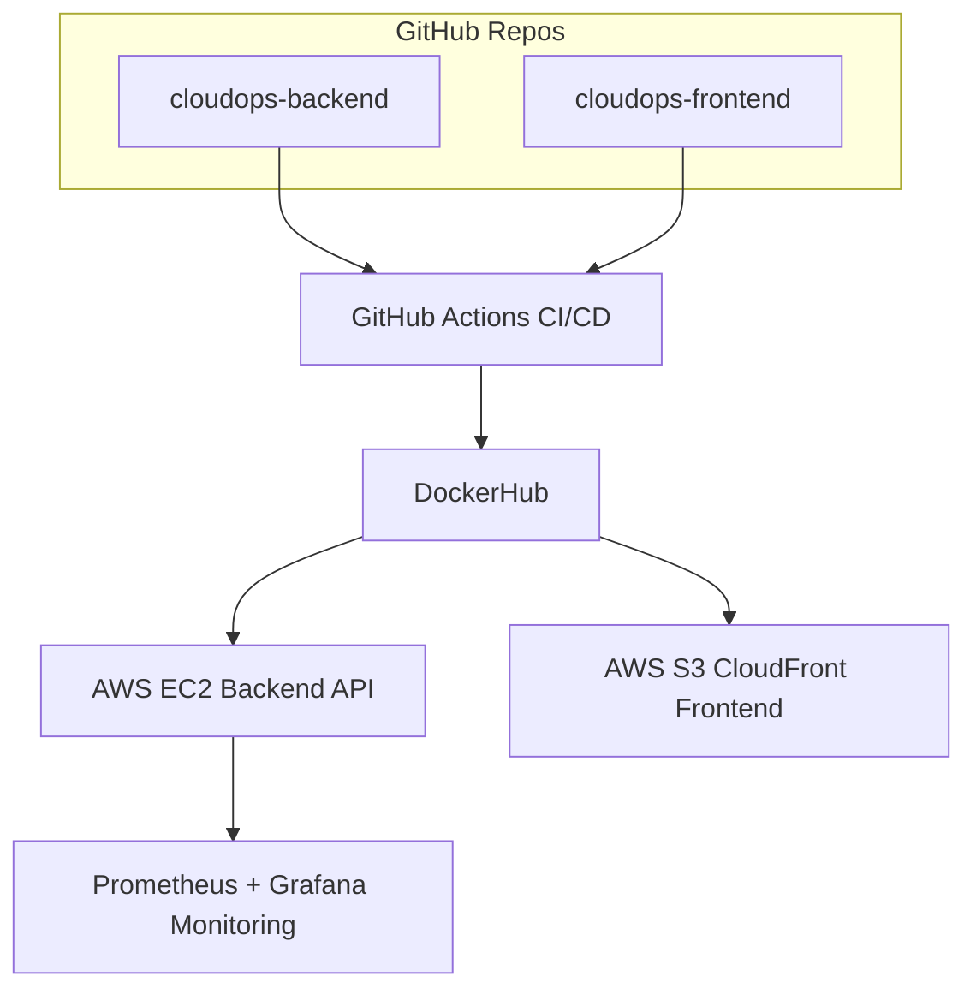

# ☁️ CloudOps Portfolio

This repository showcases my **Cloud & DevOps Engineering portfolio**.  
It demonstrates **CI/CD pipelines, containerization, Infrastructure as Code (IaC), cloud deployments, and monitoring**.

The portfolio is split into three repositories for clarity:

---

## 📂 Repositories

- [cloudops-backend](https://github.com/GhostGto/cloudops-backend)  
  Node.js + Express API (Dockerized, CI/CD with GitHub Actions)

- [cloudops-frontend](https://github.com/GhostGto/cloudops-frontend)  
  React app served with Nginx (Dockerized, CI/CD with GitHub Actions)

- [cloudops-infra](https://github.com/GhostGto/cloudops-infra)  
  AWS Infrastructure with Terraform + Monitoring stack (Prometheus + Grafana)

---

## 📊 High-Level Architecture

---

## 🚀 Features Demonstrated

- **CI/CD Pipelines**
  - Automated build, test, and deployment with GitHub Actions.
  - Docker images pushed to DockerHub.

- **Containerization**
  - Both backend and frontend fully containerized with Docker.
  - Nginx used as web server for frontend.

- **Infrastructure as Code (IaC)**
  - Terraform provisions AWS infrastructure (EC2, Security Groups, S3, CloudFront).
  - Reproducible deployments.

- **Monitoring & Alerting**
  - Prometheus scrapes backend metrics.
  - Grafana dashboards for CPU, memory, and API metrics.
  - Example alerts configured.

- **Cloud Deployment**
  - Backend deployed on AWS EC2 with Docker.
  - Frontend hosted on AWS S3 + CloudFront.

---

## 🛠️ Tech Stack

- **Languages & Frameworks:** Node.js, React
- **DevOps Tools:** Docker, GitHub Actions, Terraform
- **Cloud Services:** AWS EC2, S3, CloudFront
- **Monitoring:** Prometheus, Grafana
- **Other Tools:** Nginx, DockerHub

---

## 📌 How to Use This Portfolio

1. Explore each repository for detailed setup instructions:
   - [cloudops-backend](https://github.com/GhostGto/cloudops-backend)
   - [cloudops-frontend](https://github.com/GhostGto/cloudops-frontend)
   - [cloudops-infra](https://github.com/GhostGto/cloudops-infra)

2. Review the **README files** inside each repo for step-by-step guides.

3. Check the **diagrams and screenshots** included to understand the full architecture.

---

## 🎯 About Me

I am a **Cloud/DevOps Engineer** passionate about building scalable, automated, and secure systems.  
This portfolio demonstrates my ability to design, deploy, and manage cloud-based applications using **modern DevOps practices**.

📧 Contact: gustavo.t138@gmail.com 
🔗 LinkedIn: [linkedin.com/in/gustavo-tejedac](https://www.linkedin.com/in/gustavo-tejedac/)  
💻 GitHub: [github.com/GhostGto](https://github.com/GhostGto?tab=repositories)  

---
